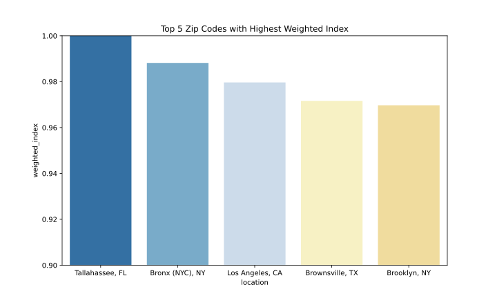
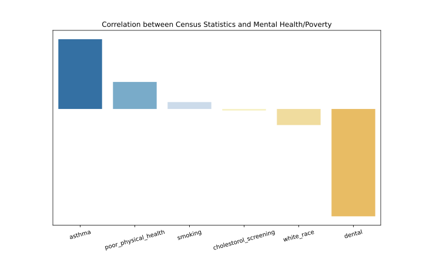
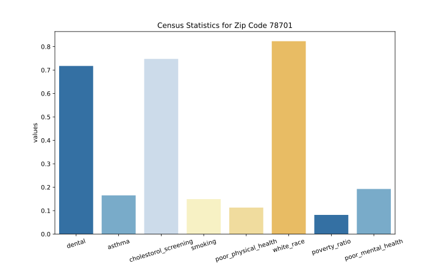

# HSI Battle of the Brains 2023 Repository
*Created by the University of Central Florida Team:*
*Alejandra Alas, Ashley Smith, Joseph Fioresi, Kenneth Colón, Meleah Chase Malcolm, Quinn Barber, Ralph Balderamos III, and Sydney Damas*

# Overview
SOL Online is a mobile/web application designed to help KPMG experts analyze and interpret population data to identify the elements that correlate to financial and mental health inequity. We show some of the potential visualization options along with how the relevant datapoints were selected.

### Example Graphs

In all of these graphs, the y_axis statistics are 0-1 normalized.

### Weighted poverty-mental\_health-population scores per zip code:

### Relative correlations of statistics that contribute to high poverty and poor mental health rates:

### Relevant Statistics for Austin Zip Code 78701:

# File Documentation
#### 1. `mental_heath_corr.py`
This file is responsible for using `pandas` and `numpy` to clean and process CDC and ACS data together. The overall goal was to locate regions to initially launch our solution initiative. We were able to do this by conglomerating region data where all population, mental health problems, and poverty information is available/collected. We then used min-max scaling in order to normalize this data relative to all other regions. With these values we used exponential weighting to calculate our overall weighted score of locations to launch our initiative. We then min-max scaled this resulting score and display the results. Our findings for the best places to launch are the following:
1. Tallahassee, Florida 32304
2. Bronx, New York 10456
3. Los Angeles, California 90011
4. Brownsville, Texas 78521
5. Brooklyn, New York 11212
 

#### 2. `cdc_analysis.py`
This file is responsible for cleaning up the CDC data from `CDC Places 2020 Health Outcomes.csv` and `CDC Places Data Dictionary.xlsx`. It maps all the abbreviated data names to their corresponding names in the dictionary. Then we form a new data frame to represent locations based off of their City/State, Population, and Mental Health statistics. We sort this data by the most mental health issues for >= 14 days per 1000 adults >= 18 years old. This data is printed and stored in the `clean_data` folder.
 

#### 3. `initial_analysis.py`
This file is responsible for cleaning all the ACS data that we were given. This is done by attributing the abbreviated data names to their dictionary values in `ACS Data Dictionary.xlsx`. All this cleaned data is then stored in the `clean_data` folder to be used by other programs.
 

#### 4. `graphing.py`
This file is responsible for graphing and charting figures throughout the application. This includes but is not limited to figures in the prototype, construction of zip code data charts in the interactive component, and figures displaying throughout the `README.md`.
 

#### 5. `create_master_file.py`
This file is responsible for compiling all the relevant data that we were able to clean, pre-process, scale, and normalize. This allows the data to be ready for `regression.py`, where machine learning techniques are used to determine correlations between different data points and increased poverty/mental heath issues. This file is saved in `clean_data` as `master.csv`.
 

#### 6. `regression.py`
This file is responsible for the actual regression model itself. Using `master.csv` we run a `Lasso` regression model on the data to determine correlation statistics. We save our results to `figures/regression_variables.svg`.
 

#### 7. `clean_data` & `data` folders
The `data` folder encompasses all the data that was provided by HSI. The only change made to the data was a conversion of the `Zip Code Index.csv` file to `Zip Code Index.xlsx`.
The `clean_data` folder encompasses processed, cleaned, and resulting data from the above files.

#### 8. `streamlit_app.py`
This file is responsible for running and managing the **Streamlit** app which is available for anyone to scan the QR code and join. This QR code is available in the presentation slides, but the site can also be accessed from the link [here](https://ucf-hsibob.streamlit.app/).
 

#### 9. `model_inference.py`
This file is reponsible for creating our mock time series data in which we predict future trends in our initial launch locations. These figures can than be seen in the **Streamlit** app where you can customize selections for your viewing pleasure.
 

# Running Yourself
1. Make sure to have Python 3.9.X or 3.10.X installed on your system along with `pip`
2. `cd` into your directory where you would like to clone our repository.
3. Use `git clone https://github.com/joefioresi718/hsi_bob.git` to clone our repository
4. Run `pip install -r requirements.txt` in your command line (`command prompt` or `powershell` on Windows and `terminal` on MAC)
5. Run the python files using compiler of your choice, see printed results and saved results
6. (Optional) View statistics that have been pre-ran in `figures` and `images` folders.
